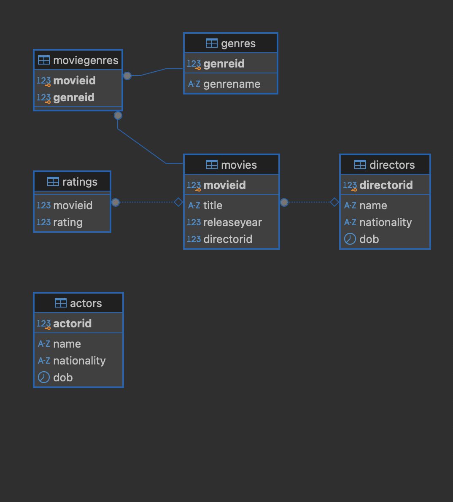

# Movie Database API

Welcome to the **Movie Database API**! This project is a Node.js application built with TypeScript that provides a RESTful API for managing a movie database. It allows for CRUD operations on movies, directors, actors, genres, and ratings.

## Database Overview

Below is the diagram representing the relationships between the different tables in the database:

## Project Overview

- **Repository Name**: node
- **Project Folder**: movie-database
- **Version**: 1.0.0
- **License**: ISC

## Getting Started

### Prerequisites

Before you begin, ensure you have the following installed on your machine:

- **Node.js** (v14 or later)
- **PostgreSQL** (any recent version)
- **npm** (comes with Node.js)

### Installation

1. **Clone the repository**:
   git clone https://github.com/haykodadyan/node.git
   cd node/movie-database

2. **Clone the repository**:

   Install the dependencies: npm install

3. **Set up your environment variables: Create a .env file in the root of the movie-database directory with your PostgreSQL connection string:**

DATABASE_URL=your_postgresql_connection_string

# Running the Application

• **Development Mode**: To start the application in development mode with TypeScript, run:

npm run dev

• **Database Migration**: To run the database migrations, use:

npm run migrate

# Docker Support

docker-compose.yml

The docker-compose.yml file simplifies the process of running the application and its dependencies in Docker containers. It typically contains the configuration for the application service and a PostgreSQL service, along with the necessary environment variables.

1. **Start the Services: First, make sure your services are running. Use the following command:**

**docker-compose up -d**

This will start your containers in detached mode.

2. **Check Container Status: After running the above command, check the status of your containers:**

docker-compose ps

This will show you if the app container is running.

3. **Run the Migration Command Again: If the app container is now running, you can execute the migration command:**

docker-compose exec app npm run migrate
